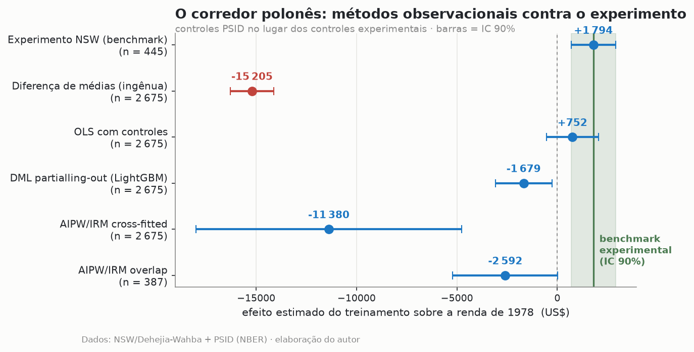

# data-science-lab

**ML a serviço da inferência.** Causal ML e forecasting técnico de fronteira — machine
learning usado para *inferir*, não só prever. Audiência: fintechs, scale-ups e times de
decision science. Prova de domínio de ML pelo motivo certo.

> A régua de cada projeto: **pergunta original · dado difícil · método não-trivial ·
> resultado acionável · apresentação obsessiva.**

**Lucas Hoffnung Bernardo** — Economist · Data Scientist · [github.com/lbhoffnung](https://github.com/lbhoffnung)

---

## Projetos

| # | Projeto | Status |
|---|---------|--------|
| 3 | **[Para quem a política funciona?](./double-ml-heterogeneidade/)** — efeitos heterogêneos com Double/Debiased ML | 🟢 V1 |
| 4 | **[Forecasting hierárquico](./forecasting-hierarquico-m5/)** — reconciliação ótima e o benchmark honesto | 🟢 V1 |

---

### 3 · Para quem a política funciona?
*Causal ML · Double ML / AIPW · Fronteira Chernozhukov–Athey*

Um tratamento tem efeito médio conhecido — mas métodos observacionais, mesmo com ML de
fronteira, conseguem sequer recuperá-lo? O experimento NSW/Lalonde é o único lugar com
gabarito para checar.

> **Resultado (V1):** trocando os controles experimentais pelo PSID, o DML remove **~80%
> do viés** da comparação ingênua — mas **não recupera o experimento**. O culpado não é o
> algoritmo, é a falta de suporte comum (74% dos controles com propensity < 0,05): a lição
> de LaLonde (1986) sobrevive ao ML de 2018. Identificação vem do desenho. → [detalhes](./double-ml-heterogeneidade/)

### 4 · Forecasting hierárquico com reconciliação ótima
*Séries hierárquicas · Reconciliação MinT · Benchmark rigoroso*

Em uma hierarquia real (estado → loja → categoria → depto), como garantir previsões
coerentes entre níveis? E quanto a reconciliação realmente melhora a acurácia?

> **Resultado (V1):** no M5-Califórnia (45 séries), um **AutoETS bem ajustado bate tudo**
> (MASE 0,817), e a reconciliação MinT ajuda pouco e depende do modelo. O valor real da
> reconciliação é a *coerência* entre níveis, não o salto de acurácia — o benchmark honesto
> que a literatura M5 confirma. → [detalhes](./forecasting-hierarquico-m5/)

---

<b>Portfolio 2.0 · Seis Joias</b> — 
<a href="https://github.com/lbhoffnung/economic-sciences-lab">economic-sciences-lab</a> · 
<a href="https://github.com/lbhoffnung/data-science-lab">data-science-lab</a> · 
<a href="https://github.com/lbhoffnung/data-analysis-lab">data-analysis-lab</a>

_Regra de execução: um projeto de cada vez, V1 impecável antes da V2._
