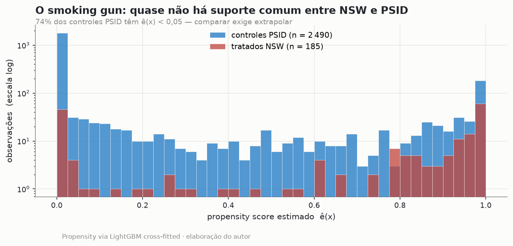
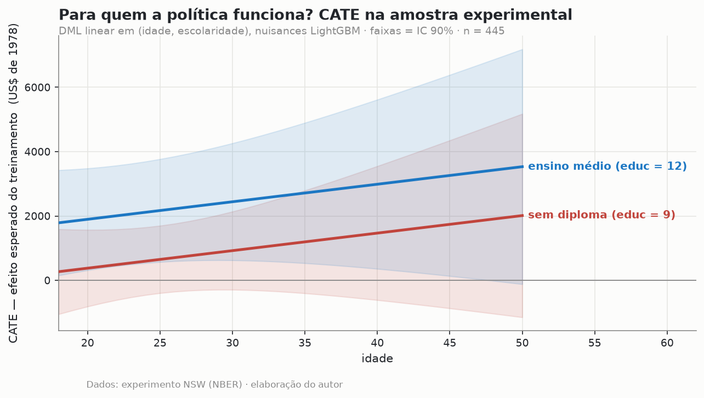

# Para quem a política funciona? Efeitos heterogêneos com Double/Debiased ML

*Causal ML · DML / AIPW · Fronteira Chernozhukov–Athey*

> 🟢 **Status: V1 concluída.** Projeto 3 do `data-science-lab`. DML partialling-out
> (econml), AIPW/IRM implementado na unha com cross-fitting, diagnóstico de overlap e
> CATE na amostra experimental. Causal Forests e política de targeting entram na V2.

---

## Pergunta

Um programa de treinamento tem efeito médio conhecido — mas **para quem** funciona?
E a pergunta anterior, que quase todo mundo pula: **métodos observacionais (mesmo com
ML de fronteira) conseguem sequer recuperar o efeito médio?** O experimento NSW/Lalonde
é o único lugar onde essa pergunta tem gabarito.

## Dados

O clássico revisitado — NSW/Dehejia-Wahba + controles PSID, direto do NBER:

| Amostra | n | Papel |
|---|---|---|
| NSW tratados | 185 | tratamento real (programa de treinamento, 1976–77) |
| NSW controles | 260 | contrafactual experimental → **benchmark: ATE = +US$ 1.794** |
| PSID controles | 2.490 | contrafactual observacional (o mundo real, sem experimento) |

Outcome: renda em 1978 (`re78`). Covariáveis: idade, escolaridade, raça, estado civil,
diploma e rendas pré-tratamento (`re74`, `re75`).

## Método (V1)

O "corredor polonês": cada estimador observacional enfrenta o benchmark experimental.

1. **Diferença de médias** (ingênua) contra o PSID.
2. **OLS com controles.**
3. **DML partialling-out** (Chernozhukov et al. 2018) via `econml.LinearDML`, nuisances
   em LightGBM, cross-fitting 5-fold.
4. **AIPW/IRM na unha** — o estimador duplamente robusto interativo, implementado em
   ~15 linhas transparentes (score de Neyman, nuisances cross-fitted), amostra completa
   e na região de overlap (ê ∈ [0,10, 0,90]).
5. **Diagnóstico de overlap**: histograma do propensity score tratados × PSID.
6. **CATE na amostra experimental** (identificação limpa): DML linear em idade ×
   escolaridade.

## Resultados

| Método | ATE (US$) | vs. benchmark |
|---|---|---|
| Experimento NSW (benchmark) | **+1 794** | — |
| Diferença de médias (PSID) | −15 205 | erra por 17 mil, sinal invertido |
| OLS com controles | +752 | perto por sorte de forma funcional |
| DML partialling-out | −1 679 | remove ~80% do viés ingênuo |
| AIPW/IRM (completo) | −11 380 | quebra sem overlap |
| AIPW/IRM (overlap) | −2 592 | melhor, ainda longe |

**O achado honesto e contraintuitivo: nem o Double ML recupera o experimento.** O ML
flexível remove ~80% do viés da comparação ingênua — automatizando o que exigiria
engenharia manual de especificação — mas o resíduo não é problema de algoritmo, é de
**identificação**: 74% dos controles PSID têm propensity < 0,05 (não há suporte comum)
e a seleção remanescente é em *não-observáveis* (o "Ashenfelter dip" pré-programa).

**A lição de LaLonde (1986) sobrevive ao ML de 2018** — e a literatura moderna concorda
(Imbens & Xu, 2024). DML é a ferramenta certa *quando a identificação já está de pé*;
não é substituto para desenho.




### Para quem funciona? (CATE no experimento)

Efeito **crescente com idade e escolaridade**: com ensino médio, de ~US$ 1.800 (18 anos)
a ~US$ 3.500 (50 anos); sem diploma, a curva parte de ~zero. O treinamento rende mais
para quem já tem capital humano básico para convertê-lo. Com n = 445, os ICs são largos —
heterogeneidade *sugerida*, não provada.



Tabela completa em [`outputs/results.md`](./outputs/results.md).

## Hipóteses de identificação (explícitas)

- **Experimento**: aleatorização ⇒ independência (Y₀,Y₁) ⊥ T. Vale por desenho.
- **Observacional**: exigiria (i) *unconfoundedness* — seleção só em observáveis — e
  (ii) *overlap* — 0 < e(x) < 1. O diagnóstico mostra (ii) violada para 3/4 da amostra;
  o Ashenfelter dip sugere (i) violada também. Por isso nenhum estimador converge ao
  benchmark — e reportar isso é o resultado.

## Limitações (honestidade V1)

- CATE linear em 2 variáveis é o corte V1; Causal Forests (heterogeneidade não
  paramétrica + honest splitting) entram na V2, com calibração e targeting out-of-sample.
- n experimental pequeno (445) ⇒ ICs largos no CATE.
- Um único dataset; a V2 adiciona um experimento de marketing em escala (Criteo Uplift).

## Reprodução

```bash
pip install -r requirements.txt
python -m src.analysis   # baixa dados do NBER, roda tudo, gera figuras e results.md
```

Notebook de ponta a ponta: [`notebooks/double-ml-lalonde.ipynb`](./notebooks/).

## Stack

`Python` · `econml` · `LightGBM` · `scikit-learn` · `statsmodels` · `matplotlib`
