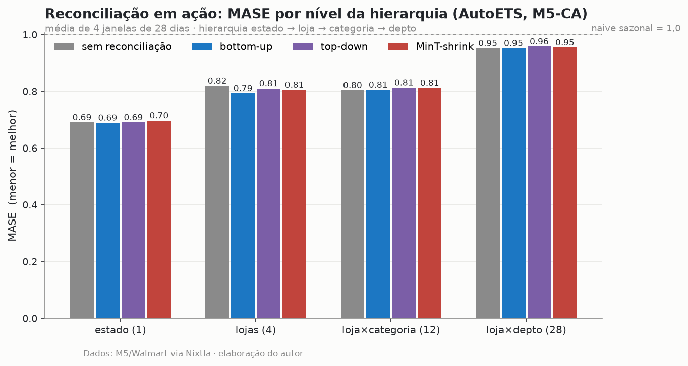
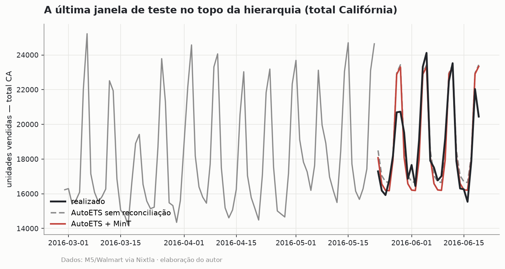

# Forecasting hierárquico com reconciliação ótima: quando o clássico vence

*Séries hierárquicas · Reconciliação MinT · Benchmark honesto*

> 🟢 **Status: V1 concluída.** Projeto 4 do `data-science-lab`. Subconjunto do M5
> (Califórnia), três baselines clássicos e três esquemas de reconciliação em backtest
> rigoroso. O desafiante neural (TFT/N-BEATS) sob o mesmo protocolo entra na V2.

---

## Pergunta

Em uma hierarquia real (estado → loja → categoria → departamento), como garantir
previsões **coerentes** entre níveis? E a pergunta que quase ninguém responde com
honestidade: **quanto a reconciliação realmente melhora a acurácia** — e vale a pena?

## Dados

Dataset **M5** (Walmart) via Nixtla, filtrado para a **Califórnia**: 4 lojas × 3
categorias × 7 departamentos, agregados numa hierarquia de **45 séries diárias**,
1.941 dias. Cada nível soma exatamente no nível acima (matriz de agregação S).

## Método (V1)

Protocolo canônico do M5, **sem look-ahead**:

- **Modelos por série** (statsforecast): `SeasonalNaive(7)`, `AutoETS`, `AutoARIMA`.
- **Reconciliação** (hierarchicalforecast): `BottomUp`, `TopDown` (forecast proportions),
  `MinTrace(mint_shrink)` — o MinT de Wickramasuriya et al. (2019).
- **Backtest**: expanding-window, 4 janelas × 28 dias (o horizonte oficial do M5).
- **Métrica**: **MASE** escalada pelo naive sazonal in-sample de cada janela (MASE < 1 =
  bate o naive sazonal).

## Resultados

**MASE médio (todas as janelas e níveis):**

| modelo | sem recon. | bottom-up | top-down | MinT-shrink |
|---|---|---|---|---|
| AutoARIMA | 0,867 | 0,886 | 0,864 | **0,841** |
| **AutoETS** | 0,817 | **0,810** | 0,818 | 0,817 |
| SeasonalNaive | 0,991 | 0,991 | 0,991 | 0,991 |





### A conclusão honesta (que a literatura M5 confirma)

1. **O clássico bem ajustado é imbatível aqui.** O `AutoETS` sozinho, *sem reconciliação*,
   já entrega MASE 0,817 — bem à frente do ARIMA (0,867) e do naive (0,991). É a lição da
   competição M5 inteira: a maioria dos métodos "modernos" não supera um ETS bem calibrado
   de forma consistente.
2. **O ganho da reconciliação é real, mas pequeno e depende do modelo base.** Para o
   AutoARIMA (mais ruidoso), MinT corta o MASE de 0,867 → **0,841**. Para o AutoETS (já
   calibrado), a reconciliação é praticamente neutra (0,817 → 0,817); só o bottom-up ajuda
   no nível de lojas (0,82 → 0,79).
3. **TopDown nunca é o melhor** e degrada levemente as folhas — proporções históricas
   apagam a dinâmica local.
4. **O verdadeiro valor da reconciliação é a coerência**, não o salto de acurácia: as
   previsões passam a somar entre níveis (requisito operacional em varejo e supply chain).
   Vender MinT como bala de prata seria desonesto; reportar o trade-off é o ponto.

## Por que é foda

Forecasting hierárquico é exatamente o que varejo, supply chain e energia precisam — e o
que projetos de Kaggle ignoram. Um benchmark que **não torce pelo modelo da moda** e admite
que o clássico vence sinaliza a senioridade técnica que separa engenheiro de praticante.

## Limitações (honestidade V1)

- Uma região (CA) e 45 séries agregadas — não os 30 mil itens do M5 completo.
- MASE simples (não o WRMSSE ponderado oficial do M5); a V2 usa a métrica oficial.
- Sem desafiante neural na V1 — o TFT/N-BEATS sob o MESMO protocolo é justamente o teste
  da V2 (a pergunta "deep learning vale a pena?" exige rodar os dois lado a lado).
- Vintages atuais; o M5 não tem revisões, então isso não enviesa aqui.

## Reprodução

```bash
pip install -r requirements.txt
python -m src.run_benchmark   # baixa o M5, roda backtest (~10 min) e gera figuras
```

Notebook: [`notebooks/m5-hierarquico.ipynb`](./notebooks/).

## Stack

`Python` · `statsforecast` / `hierarchicalforecast` (Nixtla) · `pandas` · `matplotlib`
